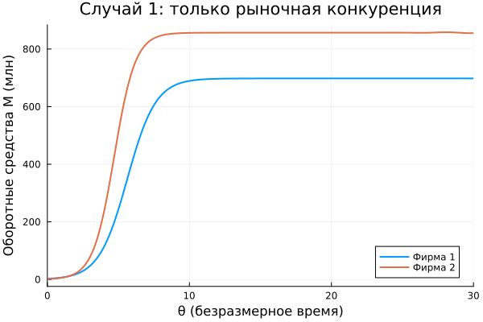

---
## Author
author:
  - name: "Малюга Валерия Васильевна"
    email: "1132236050@rudn.ru"
    affiliation: "Российский университет дружбы народов, Москва, РФ"
## Title
title: "Презентация по лабораторной работе №8"
subtitle: "Модель конкуренции двух фирм"
license: "CC BY"
date: today
date-format: "YYYY-MM-DD"
bibliography: bib/cite.bib
csl: _resources/csl/gost-r-7-0-5-2008-numeric.csl
format:
  beamer:
    toc: true
    toc-title: "Содержание"
    number-sections: false
    number-depth: 1
    colorlinks: false
    toc-depth: 1
    aspectratio: 169
    section-titles: true
    incremental: false
    navigation: horizontal
    csquotes: true
    indent: true
    include-in-header:
      - file: _resources/tex/beamer.tex
    pdf-engine: xelatex                   
    mainfont: "DejaVu Serif"              
    monofont: "DejaVu Sans Mono"          
    babel-lang: russian
    babel-otherlangs: english
    cite-method: biblatex
    biblio-style: gost-numeric
    biblatexoptions:
      - backend=biber
      - langhook=extras
      - autolang=other*
    fig-format: png
    fig-dpi: 300
    fontsize: 9pt 
  revealjs:
    transition: slide
    margin: 0.2
    smaller: true
    slide-number: true
    output-ext: html
    theme: beige
    logo: _resources/image/logo_rudn.png
    fontsize: 1.1em  
    self-contained: true
    fig-format: png
    css: styles.css
execute:
  eval: false
  echo: false
---

## Докладчик

* **Малюга Валерия Васильевна**
* Студент НФИбд-01-23
* Российский университет дружбы народов им. П. Лумумбы
* <https://vvmalyuga.github.io/ru/>
* [1132236050@rudn.ru](mailto:1132236050@rudn.ru)

# Задание

- Создать проект DrWatson, установить пакеты DifferentialEquations, Plots, Symbolics, Literate.
- Реализовать скрипт для модели конкуренции двух фирм (вариант 1).
- Вычислить коэффициенты $a_1,a_2,b,c_1,c_2$ по формулам.
- Для случая 1 (только рыночная конкуренция) решить систему ОДУ и построить графики $M_1(\theta), M_2(\theta)$.
- Для случая 2 (добавлен социально-психологический фактор $+0.001 M_1 M_2$ в первое уравнение) повторить расчёт.
- Найти стационарное состояние системы для случая 1.
- Проанализировать результаты, оформить отчёт и презентацию в Quarto.

# Теоретическое введение

## Модель одной фирмы

- Спрос: $Q = q\left(1 - \frac{p}{p_{cr}}\right)$.
- Динамика оборотных средств:
  $$\frac{dM}{dt} = -\frac{M\delta}{\tau} + NQp - \kappa.$$
- Быстрое установление цены приводит к равновесному значению $p(M)$.

## Конкуренция двух фирм

- Две фирмы производят взаимозаменяемые товары, единая цена.
- При $\kappa_i=0$ и нормировке $t = c_1\theta$ получаем систему [@tirol1988; @gibbons1992]:
  $$\frac{dM_1}{d\theta} = M_1 - \frac{b}{c_1} M_1 M_2 - \frac{a_1}{c_1} M_1^2,$$
  $$\frac{dM_2}{d\theta} = \frac{c_2}{c_1} M_2 - \frac{b}{c_1} M_1 M_2 - \frac{a_2}{c_1} M_2^2.$$

## Коэффициенты модели

- $a_1 = \frac{p_{cr}}{\tau_1^2 \tilde p_1^2 N q},\quad a_2 = \frac{p_{cr}}{\tau_2^2 \tilde p_2^2 N q}$,
- $b = \frac{p_{cr}}{\tau_1^2 \tilde p_1^2 \tau_2^2 \tilde p_2^2 N q}$,
- $c_1 = \frac{p_{cr} - \tilde p_1}{\tau_1 \tilde p_1},\quad c_2 = \frac{p_{cr} - \tilde p_2}{\tau_2 \tilde p_2}$.

## Два случая

- **Случай 1:** только рыночная конкуренция – никаких дополнительных предпочтений.
- **Случай 2:** социально-психологический фактор – в первом уравнении $\frac{b}{c_1}$ заменяется на $\frac{b}{c_1}+0.001$, что моделирует предпочтение товара второй фирмы потребителями.

# Выполнение работы

## Параметры варианта 1

- $p_{cr}=15$, $N=17$, $q=1$.
- $\tau_1=11$, $\tau_2=14$.
- $\tilde p_1=8$, $\tilde p_2=6$.
- Начальные оборотные средства: $M_1(0)=2.5$ млн, $M_2(0)=1.5$ млн.

## Вычисленные коэффициенты

- $a_1 \approx 0.000114$, $a_2 \approx 0.000125$.
- $b \approx 1.62 \times 10^{-8}$.
- $c_1 \approx 0.07955$, $c_2 = 0.10714$.
- $\frac{b}{c_1} \approx 2.04 \times 10^{-7}$ (очень мало, перекрёстное влияние слабое).

## Случай 1: график динамики

{width=70%}

- Фирма 1 выходит на $M_1^* \approx 21.7$ млн.
- Фирма 2 – на $M_2^* \approx 37.8$ млн.
- Равновесие устойчиво.

## Стационарное состояние (случай 1)

- Решение системы $dM_1/d\theta=0$, $dM_2/d\theta=0$:
  $$M_1^* = \frac{c_2 - c_1\frac{a_2}{a_1}}{b\left(\frac{a_2}{a_1} - 1\right)} \approx 21.73,\quad 
    M_2^* = \frac{1 - \frac{a_1}{c_1}M_1^*}{\frac{b}{c_1}} \approx 37.85.$$
- Матрица линеаризации имеет отрицательные собственные значения → узел.

## Случай 2: график динамики

{width=70%}

- Фирма 1 сначала растёт, но из-за усиленного перекрёстного члена ($-0.001 M_1 M_2$) её оборотные средства падают до нуля.
- Фирма 2 выходит на прежний уровень $M_2^* \approx 37.8$ млн.

## Сравнение двух случаев

| Сценарий | Фирма 1              | Фирма 2            |
|----------|----------------------|--------------------|
| Случай 1 | Остаётся на рынке     | Остаётся на рынке  |
| Случай 2 | Банкротство (M1→0)   | Захватывает рынок  |

- Социально-психологический фактор даже с малым коэффициентом ($0.001$) радикально меняет исход конкуренции.

# Выводы

1. Реализована математическая модель конкуренции двух фирм с идентичным товаром.
2. Для варианта 1 получены траектории изменения оборотных средств в двух сценариях.
3. В чисто рыночной конкуренции (случай 1) обе фирмы выживают, деля рынок пропорционально своим себестоимостям и циклам.
4. Добавление социально-психологического предпочтения (случай 2) приводит к банкротству фирмы 1 и монополизации рынка фирмой 2.
5. Найдено устойчивое стационарное состояние для случая 1, подтверждённое численно и аналитически.
6. Все скрипты оформлены в литературном стиле с использованием DrWatson и Literate.jl.

# Список литературы

::: {#refs}
:::
