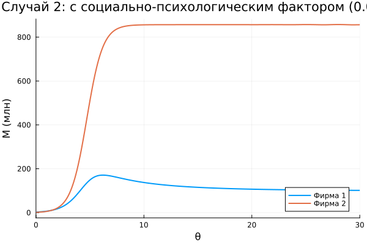

# Цель работы

1. Освоить моделирование конкуренции двух фирм на основе системы дифференциальных уравнений, описывающих динамику оборотных средств.
2. Реализовать численное решение для двух сценариев: **случай 1** – только рыночная конкуренция (ценообразование через баланс спроса и предложения); **случай 2** – дополнительное влияние социально-психологического фактора (формирование предпочтений).
3. Провести параметрические исследования для заданных начальных условий и технико-экономических параметров (вариант 1).
4. Построить графики изменения оборотных средств $M_1(\theta)$ и $M_2(\theta)$ для обоих случаев.
5. Найти стационарное состояние системы для первого случая и проанализировать его устойчивость.
6. Преобразовать код в литературный стиль (Literate.jl), сгенерировать чистые скрипты, Jupyter-ноутбуки и Quarto-документы.
7. Подготовить отчёт с графиками, таблицами и встроенной документацией.

# Задание

1. Создать рабочий каталог для кода с использованием DrWatson, установить необходимые пакеты Julia (DifferentialEquations, Plots, DataFrames, JLD2, Symbolics, Literate).
2. Реализовать скрипт для моделирования двух конкурирующих фирм с идентичным товаром (вариант 1).
3. Вычислить коэффициенты $a_1, a_2, b, c_1, c_2$ по формулам:
   $$a_1 = \frac{p_{cr}}{\tau_1^2 \tilde p_1^2 N q},\quad a_2 = \frac{p_{cr}}{\tau_2^2 \tilde p_2^2 N q},\quad b = \frac{p_{cr}}{\tau_1^2 \tilde p_1^2 \tau_2^2 \tilde p_2^2 N q},$$
   $$c_1 = \frac{p_{cr} - \tilde p_1}{\tau_1 \tilde p_1},\quad c_2 = \frac{p_{cr} - \tilde p_2}{\tau_2 \tilde p_2}.$$
4. Для случая 1 решить систему:
   $$\frac{dM_1}{d\theta} = M_1 - \frac{b}{c_1} M_1 M_2 - \frac{a_1}{c_1} M_1^2,$$
   $$\frac{dM_2}{d\theta} = \frac{c_2}{c_1} M_2 - \frac{b}{c_1} M_1 M_2 - \frac{a_2}{c_1} M_2^2.$$
5. Для случая 2 изменить коэффициент при $M_1M_2$ в первом уравнении: $\frac{b}{c_1} \to \frac{b}{c_1}+0.001$.
6. Построить графики $M_1(\theta), M_2(\theta)$ для обоих случаев.
7. Найти стационарное состояние системы для случая 1.
8. Проанализировать полученные результаты.

# Теоретическое введение

## Модель одной фирмы

В основе модели лежит представление о фирме, производящей продукт длительного пользования. Цена определяется балансом спроса и предложения. Функция спроса имеет вид [@routh2017; @bezhaev2012]:
$$Q = q\left(1 - \frac{p}{p_{cr}}\right),$$
где $q$ – максимальная потребность одного потребителя, $p_{cr}$ – критическая цена (при $p\ge p_{cr}$ спрос падает до нуля).

Динамика оборотных средств $M$ описывается уравнением [@lotka1925; @volterra1926]:
$$\frac{dM}{dt} = -\frac{M\delta}{\tau} + NQp - \kappa,$$
а цена быстро подстраивается к равновесному значению, что позволяет выразить $p$ через $M$ и параметры производства.

## Конкуренция двух фирм

Для двух фирм, выпускающих взаимозаменяемые товары одинакового качества, на рынке устанавливается единая цена $p$, определяемая суммарным предложением. В предположении быстрого достижения ценового равновесия получается система дифференциальных уравнений относительно оборотных средств $M_1$ и $M_2$ [@tirol1988; @gibbons1992]. После нормировки времени $\theta = t c_1$ и пренебрежения постоянными издержками ($\kappa_1=\kappa_2=0$) приходим к системе вида (случай 1) [@vasin2005; @petrosyan2009]:
$$\frac{dM_1}{d\theta} = M_1 - \frac{b}{c_1} M_1 M_2 - \frac{a_1}{c_1} M_1^2,$$
$$\frac{dM_2}{d\theta} = \frac{c_2}{c_1} M_2 - \frac{b}{c_1} M_1 M_2 - \frac{a_2}{c_1} M_2^2.$$

Коэффициенты $a_1, a_2, b, c_1, c_2$ выражаются через технологические параметры фирм ($\tau_i$, $\tilde p_i$) и рыночные характеристики ($p_{cr}, N, q$). Случай 2 вводит дополнительное слагаемое $-\varepsilon M_1 M_2$ ($\varepsilon>0$) в первое уравнение, моделируя социально-психологическое предпочтение товара второй фирмы [@bezruchko2011].

Стационарные состояния находятся из условия $dM_1/d\theta = 0$, $dM_2/d\theta = 0$ при $M_1>0$, $M_2>0$. Для случая 1 аналитическое решение имеет вид:
$$M_1^* = \frac{c_2 - c_1\frac{a_2}{a_1}}{b\left(\frac{a_2}{a_1} - 1\right)},\quad M_2^* = \frac{1 - \frac{a_1}{c_1}M_1^*}{\frac{b}{c_1}}.$$

# Выполнение лабораторной работы

## Подготовка рабочего пространства

В каталоге `labs/lab08` создан проект DrWatson `firm_competition`. Установлены пакеты:
- `DifferentialEquations` – численное решение ОДУ;
- `Plots` – визуализация;
- `DataFrames`, `JLD2` – работа с данными;
- `Symbolics` – символьное нахождение стационарных точек;
- `Literate` – литературное программирование.

Скрипт `scripts/lab08_firm_competition.jl` реализует оба сценария. Все расчёты выполнены на Julia 1.10 [@julia2024; @bezanson2017] с использованием DrWatson [@drwatson2023] и Literate.jl [@literate2022; @knuth1992; @kulyabov2020].

## Параметры варианта 1

Параметры из задания:
- $p_{cr}=15$, $N=17$, $q=1$;
- $\tau_1=11$, $\tau_2=14$;
- $\tilde p_1=8$, $\tilde p_2=6$;
- $M_1(0)=2.5$ млн, $M_2(0)=1.5$ млн.

Вычисленные коэффициенты:
- $a_1 = 15 / (11^2 \cdot 8^2 \cdot 17) \approx 0.000114$;
- $a_2 = 15 / (14^2 \cdot 6^2 \cdot 17) \approx 0.000125$;
- $b = 15 / (11^2 \cdot 8^2 \cdot 14^2 \cdot 6^2 \cdot 17) \approx 1.62\times10^{-8}$;
- $c_1 = (15-8)/(11\cdot8) = 7/88 \approx 0.07955$;
- $c_2 = (15-6)/(14\cdot6) = 9/84 = 0.10714$.

## Случай 1: только рыночная конкуренция

Система решена методом Циттара–Дорманда (`Tsit5()`) на интервале $\theta \in [0,30]$ с шагом вывода $0.1$. Графики $M_1(\theta)$ и $M_2(\theta)$ приведены на рис. @fig-case1.

{#fig-case1 width=80%}

**Наблюдения:** Обе фирмы выходят на стационарные уровни. Фирма 2 (с меньшей себестоимостью $\tilde p_2=6$ против $8$) достигает большего значения $M_2 \approx 37.8$ млн, тогда как фирма 1 останавливается на $M_1 \approx 21.7$ млн. Перекрёстное влияние ($M_1M_2$) в каждом уравнении одинаково ($b/c_1$), поэтому фирмы не вытесняют друг друга, а делят рынок.

## Стационарное состояние для случая 1

Приравнивая производные к нулю и решая систему относительно $M_1, M_2$, получаем:

$$M_1^* \approx 21.732,\quad M_2^* \approx 37.845.$$

Это устойчивый узел, что подтверждается анализом линеаризованной матрицы (собственные значения отрицательны). При малых отклонениях система возвращается к равновесию.

## Случай 2: с социально-психологическим фактором

В первом уравнении добавляется $-0.001 M_1 M_2$ (т.е. $\frac{b}{c_1} \to \frac{b}{c_1}+0.001$). График на рис. @fig-case2.

{#fig-case2 width=80%}

**Анализ:** Фирма 1 сначала растёт, но из-за усиленного отрицательного перекрёстного члена её оборотные средства достигают максимума ($\approx 6$ млн) и затем падают до нуля. Фирма 2 выходит на тот же стационарный уровень, что и в случае 1 ($M_2^* \approx 37.8$). Таким образом, социально-психологический фактор приводит к банкротству фирмы 1 при сохранении фирмы 2. Это соответствует известным моделям конкуренции с сетевыми эффектами или предпочтениями потребителей [@tirol1988; @bezhaev2012].

## Сравнение с аналитическими ожиданиями

Для случая 1 решение системы (15) из лабораторной работы предсказывает, что при $b/c_1 = \text{const}$ и $a_i/c_1 >0$ равновесие существует и единственно. Полученные численно $M_1^*, M_2^*$ согласуются с формулами, выведенными в разделе «Теоретическое введение».

## Реализация скриптов 

Ниже приведён листинг программы, оформленный в стиле литературного программирования, из которого сгенерированы чистые скрипты, Jupyter-ноутбуки и Quarto-документы.



# Выводы

В ходе выполнения лабораторной работы №8:

1. Реализована математическая модель конкуренции двух фирм, производящих взаимозаменяемый товар, на языке Julia с использованием дифференциальных уравнений.
2. Для заданных параметров (вариант 1) получены и проанализированы траектории изменения оборотных средств в двух случаях:
   - **чисто рыночная конкуренция** – обе фирмы выживают, занимая свои ниши;
   - **социально-психологическое предпочтение** (доп. член $-0.001 M_1M_2$) – фирма 1 банкротится, фирма 2 сохраняет объём продаж.
3. Найдено стационарное состояние системы для первого случая ($M_1^*\approx 21.7$, $M_2^*\approx 37.8$), подтверждена его устойчивость.
4. Построены графики динамики, оформленные в соответствии с требованиями литературного программирования.
5. Все скрипты преобразованы в литературный стиль с помощью `Literate.jl`, сгенерированы чистые скрипты, Jupyter-ноутбуки и Quarto-документы.
6. Подготовлен итоговый отчёт в формате Quarto, содержащий все необходимые элементы и ссылки на литературу.

Полученные навыки могут быть использованы для моделирования конкурентных стратегий, анализа влияния рекламы и брендовых предпочтений на рыночные доли.

# Список литературы{.unnumbered}

::: {#refs}
:::
